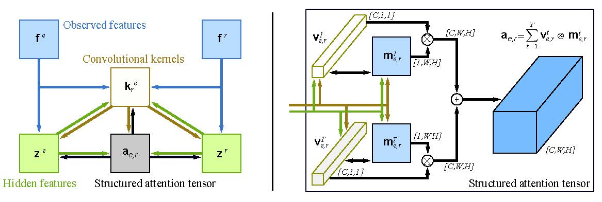
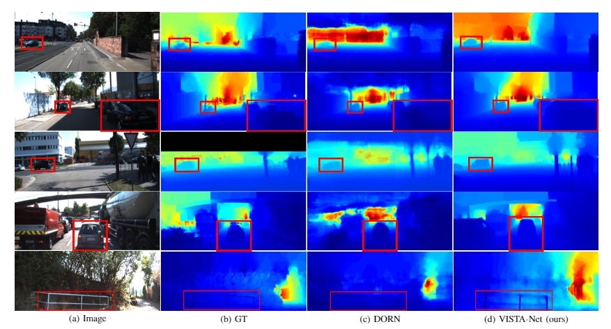

# VISTA-Net
Official PyTorch code for [Variational Structured Attention Networks for Deep Visual Representation Learning](https://arxiv.org/pdf/2103.03510.pdf). <br>
[Guanglei Yang](https://scholar.google.com/citations?user=DHgNKnAAAAAJ&hl=en), Paolo Rota , [Xavier Alameda-Pineda](http://xavirema.eu/students/), [Dan Xu](https://www.danxurgb.net/), Mingli Ding, [Elisa Ricci](https://scholar.google.com/citations?hl=en&user=xf1T870AAAAJ&view_op=list_works&sortby=pubdate), accepted at IEEE Transactions on Image Processing (TIP). <br>
Framework:

visualization results: 


## Prepare Environment
```bash
git clone https://github.com/ygjwd12345/VISTA-Net.git
cd VISTA-net/
```

This code needs Pytorch 1.0+ and python 3.6. Please install dependencies by running
```bash
pip install -r requirements.txt
```
 and you also need to install [pytorch-enconding](https://github.com/zhanghang1989/PyTorch-Encoding) and [detail-api](https://github.com/zhanghang1989/detail-api).
## Prepare datasets
### prepare nyu
```bash
mkdir -p pytorch/dataset/nyu_depth_v2
python utils/download_from_gdrive.py 1AysroWpfISmm-yRFGBgFTrLy6FjQwvwP pytorch/dataset/nyu_depth_v2/sync.zip
cd pytorch/dataset/nyu_depth_v2
unzip sync.zip
```
test set
```bash
go to utils
wget http://horatio.cs.nyu.edu/mit/silberman/nyu_depth_v2/nyu_depth_v2_labeled.mat
python extract_official_train_test_set_from_mat.py nyu_depth_v2_labeled.mat splits.mat ../pytorch/dataset/nyu_depth_v2/official_splits/

```
### Prepare kitti
```bash
cd dataset
mkdir kitti_dataset
cd kitti_dataset
### image move kitti_archives_to_download.txt into kitti_dataset
wget -i kitti_archives_to_download.txt

### label
wget https://s3.eu-central-1.amazonaws.com/avg-kitti/data_depth_annotated.zip
unzip data_depth_annotated.zip
cd train
mv * ../
cd ..  
rm -r train
cd val
mv * ../
cd ..
rm -r val
rm data_depth_annotated.zip
```
### Prepare pascal context dataset

First way is running `./scripts/prepare_pcontext.py`.

Seconde way is just download from [google drive](https://drive.google.com/open?id=13TLw6TR22K8CwUOOLEvPyOJ9SnjUg0Tx) (about 2.42GB).

Third it also auto down load and prepocess but expend huge time.
### Prepare pascal dataset
 running `./scripts/prepare_pascal.py`.
 
### Prepare cityscape dataset
 running `./scripts/prepare_citys.py`.

## Train and test

### Depth
train
```bash
CUDA_VISIBLE_DEVICES=0,1,2,3 python bts_main.py arguments_train_nyu.txt
CUDA_VISIBLE_DEVICES=0,1,2,3 python bts_main.py arguments_train_eigen.txt
```
 test
```bash
CUDA_VISIBLE_DEVICES=1 python bts_test.py arguments_test_nyu.txt
python ../utils/eval_with_pngs.py --pred_path vis_att_bts_nyu_v2_pytorch_att/raw/ --gt_path ../../dataset/nyu_depth_v2/official_splits/test/ --dataset nyu --min_depth_eval 1e-3 --max_depth_eval 10 --eigen_crop
CUDA_VISIBLE_DEVICES=1 python bts_test.py arguments_test_eigen.txt
python ../utils/eval_with_pngs.py --pred_path vis_att_bts_eigen_v2_pytorch_att/raw/ --gt_path ./dataset/kitti_dataset/ --dataset kitti --min_depth_eval 1e-3 --max_depth_eval 80 --do_kb_crop --garg_crop
```
### Segmentation
for mult GPU, we recommand is `at least 4 GPU at least 24 GB`. at least `2 GPU at least 11GB`

Train
```bash
 CUDA_VISIBLE_DEVICES=0,1,2,3 python train.py --dataset pcontext \
    --model encnet --attentiongraph --aux --se-loss \
    --backbone resnet101 --checkname attentiongraph_res101_pcontext_v2
 ```
 Test
 ```bash
 python test.py --dataset pcontext \
    --model encnet --attentiongraph --aux --se-loss \
    --backbone resnet101 --resume ./pcontext/attentiongraph_res101_pcontext_v2/model_best.pth.tar --split val --mode testval --ms
 ```
### Surface normal
 ```bash
CUDA_VISIBLE_DEVICES=0,1,2 python -m torch.distributed.launch train_surface_normal.py\
 --log_folder './log/training_release/' --operation 'train_robust_acos_loss' \
 --learning_rate 0.0001 --batch_size 32 --net_architecture 'd_fpn_resnext101' \
 --train_dataset 'scannet_standard' --test_dataset 'scannet_standard'  \
 --test_dataset 'nyud' --val_dataset 'scannet_standard'
 ```

## Reference
[BTS](https://github.com/cogaplex-bts/bts)

[Do‘s code](https://github.com/MARSLab-UMN/TiltedImageSurfaceNormal)


## Citation
Please consider citing the following paper if the code is helpful in your research work:
```
@article{yang2021variational,
  title={Variational Structured Attention Networks for Deep Visual Representation Learning},
  author={Yang, Guanglei and Rota, Paolo and Alameda-Pineda, Xavier and Xu, Dan and Ding, Mingli and Ricci, Elisa},
  journal={TIP},
  year={2021}
}

@article{xu2020probabilistic,
  title={Probabilistic graph attention network with conditional kernels for pixel-wise prediction},
  author={Xu, Dan and Alameda-Pineda, Xavier and Ouyang, Wanli and Ricci, Elisa and Wang, Xiaogang and Sebe, Nicu},
  journal={IEEE Transactions on Pattern Analysis and Machine Intelligence},
  year={2020}
}
```
